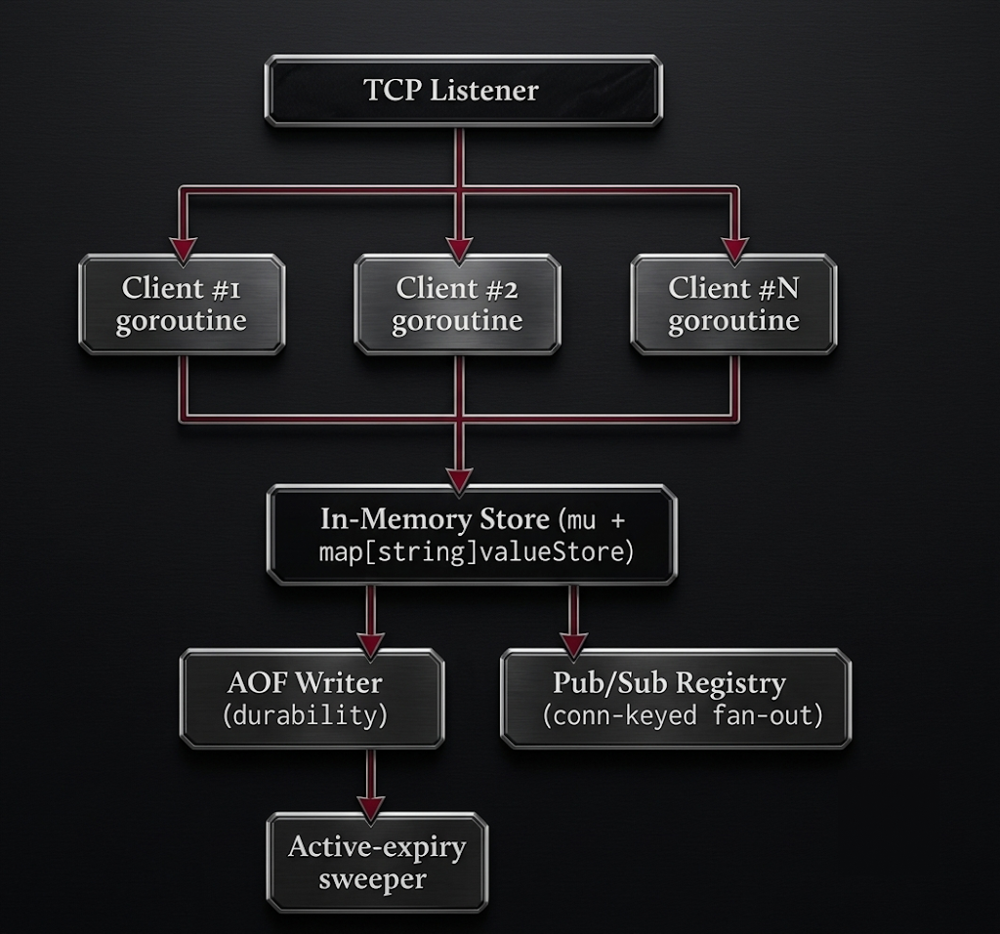

<div align="center">

```
██╗  ██╗██████╗ ██╗███████╗
██║ ██╔╝██╔══██╗██║██╔════╝
█████╔╝ ██║  ██║██║███████╗
██╔═██╗ ██║  ██║██║╚════██║
██║  ██╗██████╔╝██║███████║
╚═╝  ╚═╝╚═════╝ ╚═╝╚══════╝
```


<br/>


**Kdis** is what happens when you decide the only way to *actually* understand a database is to build one yourself — byte by byte, goroutine by goroutine.

</div>

---

## What is this?

Kdis is a from-scratch, in-memory key-value store that speaks **RESP** — the exact wire protocol real Redis uses. That means real `redis-cli` connects to Kdis, runs real commands, and gets real replies, with zero modification on the client side.

No frameworks hiding the networking. No ORM hiding the data structures. Just raw TCP sockets, a hand-written protocol parser, and goroutines doing what goroutines do best.




## ✨ Features

**Working today:**

| | Feature |
|---|---|
| ✅ | RESP2 protocol — hand-written parser & encoder, `redis-cli` compatible |
| ✅ | Concurrent TCP server — one goroutine per connection |
| ✅ | Strings — `SET`, `GET`, `DEL`, `EXISTS` |
| ✅ | Expiry — `EXPIRE`, `PEXPIRE`, `TTL`, with **both** passive (lazy) and active (background sweep) expiration |
| ✅ | Lists — `LPUSH`, `RPUSH`, `LRANGE` |
| ✅ | Hashes — `HSET`, `HGET`, `HGETALL` |
| ✅ | Sets — `SADD`, `SMEMBERS`, `SISMEMBER` |
| ✅ | Unified, type-checked keyspace — every key knows its own type, `WRONGTYPE` errors included |
| ✅ | **AOF persistence** — every write logged in its own RESP form, replayed on startup, survives a hard restart |
| ✅ | **Pub/Sub** — `SUBSCRIBE` / `PUBLISH`, connection-keyed subscriber registry, buffered channels |
| ✅ | **Two benchmarked concurrency architectures** — mutex-per-connection vs. a single channel-fed command executor (see results below) |

**In progress:**

| | Feature |
|---|---|
| 🚧 | **Phase 2:** Raft-based replication via `hashicorp/raft` — Kdis, but distributed across multiple nodes |

---

## 🚀 Quick Start

```bash
git clone https://github.com/shivanshumangal007-dev/kdis.git
cd kdis
go run ./cmd/server
```

You should see:
```
listening on the port:  :6379
```

In another terminal, talk to it with the real thing:

```bash
redis-cli -p 6379
```

```
127.0.0.1:6379> SET language go
OK
127.0.0.1:6379> GET language
"go"
127.0.0.1:6379> EXPIRE language 60
(integer) 1
127.0.0.1:6379> TTL language
(integer) 57
127.0.0.1:6379> LPUSH stack "TCP" "RESP" "goroutines"
(integer) 3
127.0.0.1:6379> LRANGE stack 0 2
1) "goroutines"
2) "RESP"
3) "TCP"
```

**Durability**, proven the only honest way — kill the process and bring it back:
```bash
redis-cli -p 6379 SET language go
kill -9 <server-pid>
go run ./cmd/server
redis-cli -p 6379 GET language   # => "go", rebuilt from the AOF log
```

If `redis-cli` — a real, unmodified, off-the-shelf client — talks to your server correctly, that's the whole proof: Kdis speaks the real protocol, not an approximation of it.

---

## 📖 Command Reference

<details>
<summary><b>Strings & Keys</b></summary>

| Command | Description |
|---|---|
| `SET key value` | Set a string value |
| `GET key` | Retrieve a string value |
| `DEL key` | Delete a key |
| `EXISTS key` | Check if a key exists |
| `EXPIRE key seconds` | Set a TTL, in seconds |
| `PEXPIRE key ms` | Set a TTL, in milliseconds |
| `TTL key` | Remaining TTL in seconds (`-1` = no TTL, `-2` = key doesn't exist) |

</details>

<details>
<summary><b>Lists</b></summary>

| Command | Description |
|---|---|
| `LPUSH key val [val ...]` | Push value(s) onto the head |
| `RPUSH key val [val ...]` | Push value(s) onto the tail |
| `LRANGE key start stop` | Get a range of elements (inclusive) |

</details>

<details>
<summary><b>Hashes</b></summary>

| Command | Description |
|---|---|
| `HSET key field value` | Set a hash field |
| `HGET key field` | Get a hash field |
| `HGETALL key` | Get all fields and values |

</details>

<details>
<summary><b>Sets</b></summary>

| Command | Description |
|---|---|
| `SADD key member [member ...]` | Add member(s) to a set |
| `SMEMBERS key` | List all members |
| `SISMEMBER key member` | Check membership |

</details>

<details>
<summary><b>Pub/Sub</b></summary>

| Command | Description |
|---|---|
| `SUBSCRIBE channel` | Listen for messages on a channel (connection stays open, pushed messages arrive live) |
| `PUBLISH channel message` | Send a message to all current subscribers of a channel |

</details>

---

## ⚙️ How it actually works

Every key in Kdis is stored as a **type-tagged struct**, not a loose `interface{}` — the same underlying idea real Redis uses internally, where every object carries its type alongside its data:

```go
type valueStore struct {
	kind      ValueType // TypeString, TypeList, TypeHash, TypeSet
	strVal    string
	listVal   []string
	hashVal   map[string]string
	setVal    map[string]struct{}
	expiresAt time.Time
}
```

This gives Kdis a **unified keyspace** — `EXISTS`, `DEL`, `TTL`, and `EXPIRE` all work generically across any type — while still catching type mismatches at the type level instead of scattering `interface{}` assertions through every command handler.

**Expiry runs two ways, simultaneously:**
- **Passive** — every read checks the key's `expiresAt` and lazily deletes it if it's past due.
- **Active** — a background goroutine on a `time.Ticker` independently sweeps the whole keyspace, so memory gets reclaimed even for keys nobody's reading anymore.

**Durability** comes from an append-only file: every mutating command is written to disk in its own RESP-encoded form — the exact same format it arrived in — so the replay path on startup reuses the very same parser that handles live connections. No second format to maintain, no drift between how a command is read live versus read back from the log.

**Pub/Sub** is keyed by connection, not by subscription handle — a subscriber registry maps `net.Conn → channel name`, so cleanup on disconnect is a single unconditional call, correct whether a connection subscribed to zero, one, or several channels. `PUBLISH` copies out the relevant subscriber list under a brief read lock, then releases it *before* sending to any subscriber — so one slow or blocked subscriber can never stall every other `SUBSCRIBE`/`PUBLISH` happening elsewhere in the system.

---

## 📊 Benchmarked: two ways to protect shared state

Every command eventually has to touch the same in-memory map from many goroutines at once. Kdis was built with **two different answers** to that problem, both implemented and measured head-to-head rather than picked by instinct:

- **V1 — mutex-per-connection**: every connection's goroutine calls directly into the store, synchronized with a `sync.RWMutex`.
- **V2 — single command executor**: every connection sends its parsed command into a shared channel; one dedicated goroutine drains it and is the *only* thing that ever touches the store — no locking needed, mirroring how real Redis avoids locks by being single-threaded for command execution.

A self-written concurrent load-testing client (`bench/client.go`) drove both, at 30 and 50 simulated clients:

| Clients | Cmds/client | Total cmds | V1 SET | V2 SET | V1 GET | V2 GET |
|---|---|---|---|---|---|---|
| 30 | 1,000 | 30,000 | ~85-90k/s | ~78-88k/s | ~87k/s | ~88k/s |
| 30 | 10,000 | 300,000 | ~87-91k/s | ~84-90k/s | ~90k/s | ~90k/s |
| 50 | 1,000 | 50,000 | ~84-89k/s | ~85-89k/s | ~88k/s | ~88k/s |
| 50 | 10,000 | 500,000 | ~86-91k/s | ~90-94k/s | ~91k/s | ~90k/s |

**Finding:** at this concurrency (30-50 clients, localhost), the two architectures perform about the same — both land in the ~85-90k ops/sec range on both `SET` and `GET`. The bottleneck at this scale appears to be per-command I/O overhead (TCP round trip, syscalls, RESP parsing) rather than lock contention — the critical section itself (a single map operation) is cheap enough that it barely matters *how* it's protected until concurrency climbs much higher. A genuinely useful, honest result from running the experiment instead of assuming the answer.

---

## 🛣️ Why build this at all?

Frameworks are great at their job — which is exactly the problem, if the job is *understanding what's underneath them*. Kdis exists to answer, from first principles:

- How does a binary protocol actually get parsed off a raw TCP stream?
- What really happens when two goroutines fight over the same map?
- Why does a real database choose durability trade-offs the way it does?
- Does a fancier concurrency architecture actually matter, or is that assumed too easily? (Turns out: depends on scale — see above.)
- What does "distributed" actually mean, once you've built the single-node version yourself?

**Phase 2, in progress now**, pushes Kdis across multiple nodes with **Raft consensus** via `hashicorp/raft` — the same core mechanism behind systems like etcd — because the best way to understand distributed systems is to build the thing that has to survive a node dying mid-write.

---

<div align="center">

**Built line by line, bug by bug, one `redis-cli` session at a time.**

*Shipping > Talking.*

</div>